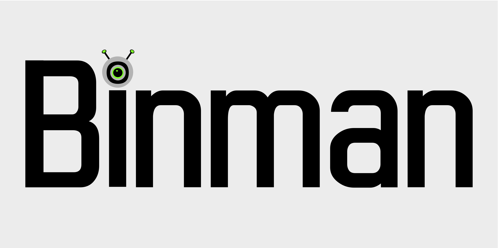

## General

Binman is a tool to sync release assets from github to your local workstation. The main use case is syncing via config to keep the tools you use every day up to date.

Grab the latest release [here](https://github.com/rjbrown57/binman/releases), and let binman grab it for you next time :rocket:

Binman will attempt to find a release asset that matches your OS and architecture and one of the types of files we handle currently. Currently handled file types are "zip", "tar", "binary", "exe".

When a matching release asset is found it will be downloaded to your `releasepath` or the default `$HOME/binMan`. The download file will be placed at `$releasepath/repos/${githuborg}/${githubproject}/${version}/`. If the asset is an archive all files will be extracted. Binman will then attempt to find a binary and will link it to `$releasepath/${githubproject}`.

Just add the releasepath to your shell PATH var and you are good to go!  

Binman provides many config options to allow you to handle all the manifold release styles on github. Check out the [config options section](#config-options) for details.

## Config Sync

To run binman you effectively you need a config. 

Running binman with no arguements and no config will populate the following config to your OS's appropriate [config directory](https://pkg.go.dev/os#UserConfigDir). On linux the config file will be added to `~/.config/binman/config`. 

Binman also allows supplying a configfile from an alternate path with the `-c` flag or by the "BINMAN_CONFIG" environment variable.

Here's an example config file

```yaml
config:
  releasepath:  #path to keep fetched releases. $HOME/binMan is the default
  tokenvar: #environment variable that contains github token
  upx: #Compress binaries with upx
    enabled: false
    args: [] # arrary of args for upx
releases:
  - repo: rjbrown57/binman
    linkname: mybinman  
    downloadonly: false 
    upx: 
      args: [] #["-k","-v"]
```

Binman can also run with a "contextual" config file. If a directory contains a file ".binMan.yaml" this will be merged with your main config. This can be checked into git projects and used to fetch any required dependencies from github.

### Config Options

Top level `config:` options

| key      | Description |
| ----------- | ----------- |
| releasepath | Path to publish files to |
| tokenvar   | github token to use for auth. You can get yourself rate limited if you have a sizeable config. Instructions to [generate a token are here](https://docs.github.com/en/authentication/keeping-your-account-and-data-secure/creating-a-personal-access-token") |
| upx   | config to enable upx shrinking. Details below |

### Release options

These options can be set per release

| key      | Description |
| ----------- | ----------- |
| arch   | target architecture |
| downloadonly   | default `false`. Set to true if you don't want binman to try to extract and link the asset |
| externalurl | see [externalurl support](#external-url-support) |
| linkname | by default binman will create a symlink matching the project name. This can be overidden with linkname set per release |
| releasefilename | in some cases project publish assets that have different names than the github project. For example [cilium-cli](github.com/cilium/cilium-cli) publishs a cli `cilium`. We would set `cilium` here so binman knows what to look for |
| os | target OS  |
| upx | see [upx Config](#upx-config) |
| version | pin to a specific release version |
| postcommands | see [post commands](#post-commands)|

## External Url Support

binman currently supports fetching version information from github, and then downloading the asset from a seperate url. Templating via go templates and [sprig](https://masterminds.github.io/sprig/) can be performed on the url to allow substitution of the fetched tag.

The following values are provided that are commonly used with external urls. See [string templating](#string-templating) for a full list.

* os
* arch
* version

```yaml
releases:
  - repo: kubernetes/kubernetes # a basic example
    url: "https://dl.k8s.io/release/{{.version}}/bin/{{.os}}/{{.arch}}/kubectl",
  - repo: hashicorp/terraform # a sprig example
    url: https://releases.hashicorp.com/terraform/{{ trimPrefix "v" .version }}/terraform_{{ trimPrefix "v" .version }}_{{.os}}_{{.arch}}.zip`, 

```

 For convenience a list of "known" repositories is kept with the templating all figured out for you. Just leave the url field blank for these and binman will take care of it.

 Current "known" repos are:

* kubernetes/kubernetes
  * Please note this is currently harcoded to fetch kubectl. If you want a different binary set additional `repo: kubernetes/kubernetes` and specify the url field for each additional binary.
* helm/helm
* hashicorp/terraform

## Post Commands

binman suppors executing arbitrary os commands after it has fetched and setup a release artifact for you. The templating detailed in [string templating](#string-templating) is available to post command args. A simple example is to copy the file to a new location.

```yaml
releases:
  - repo: rjbrown57/binextractor
      releasefilename: binextractor_0.0.1-alpha_linux_amd64
      downloadonly: true
      postcommands:
      - command: cp
        args: ["{{ .artifactpath }}","/tmp/binextractor"]
```

A more complex example would be to do a docker build.

```yaml
releases:
  - repo: rjbrown57/binman
    postcommands:
    - command: docker
      args: ["build","-t","{{ .project }}","--build-arg","VERSION={{ .version }}","--build-arg","FILENAME={{ .filename }}","/home/lookfar/binMan/repos/{{ .org }}/{{ .project }}/"]
```

For this to work you must pace a docker file at `~/binMan/repos/rjbrown57/binman/Dockerfile`. An example of the Dockerfile is

```Dockerfile
FROM ubuntu:22.04
ARG VERSION
ARG FILENAME
COPY $VERSION/$FILENAME /usr/local/bin/$FILENAME
```

These are just a pair of possible postcommands. See what trouble you can get yoruself into :rocket:

### Upx Config

Binman allows for shrinking of your downloaded binaries via [upx](https://upx.github.io/). Ensure upx is in your path and add the following to your binman config to enable shrinking via UPX.

```yaml
config:
  upx: #Compress binaries with upx
    enabled: false
    args: [] # arrary of args for upx https://linux.die.net/man/1/upx

```

## String Templating

Binman supports templating via go templates and [sprig](https://masterminds.github.io/sprig/) can be performed on several fields in your config file.

Templating is availab on the following fields

* url
* releasefilename
* postcommands args

The following values are provided
| key | notes |
| ----------- | ----------- |
| os | the configured os. Usually the os of your workstation |
| arch | the configured architecture. Usually the arch of your workstation
| version | the asset version we have fetched from github |
| project | the github project name |
| org | the github org name |
| artifactpath | the full path to the final extracted release artifact. * |
| link | the full path to link binman creates. * |
| filename | just the file name of the final release artifact. * |

\* these values are only available to args in postcommands actions.

## Direct Repo sync

Binman can also be used to grab a specifc repository with the syntax `binman -r rjbrown57/binman`

```Shell
binman -r rjbrown57/binman                                                         
INFO[0000] binman sync begin                            
INFO[0000] direct repo download                         
INFO[0000] Downloading https://github.com/rjbrown57/binman/releases/download/v0.0.12/binman_linux_amd64 
INFO[0002] Download https://github.com/rjbrown57/binman/releases/download/v0.0.12/binman_linux_amd64 complete 
INFO[0002] binman finished!          
```

## Using "ghcr.io/rjbrown57/binman:latest" container image

You can use the binman image in a multi-stage build to grab binaries for docker images.

```Dockerfile
FROM ghcr.io/rjbrown57/binman:latest AS binman
RUN binman -r "sigstore/cosign"
FROM ubuntu:latest
COPY --from=binman /cosign-linux-amd64 /usr/bin/cosign
RUN chmod 755 /usr/bin/cosign
```
