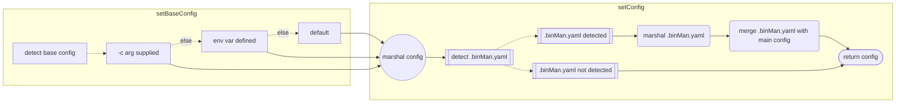

# config options logic

The below chart describes the current config selection / marshalling logic

```mermaid
flowchart LR
    subgraph setBaseConfig
    0A[detect base config] .-> A 
    A .-> |else| B
    B .-> |else| C
    end
    C --> D
    subgraph setConfig
    B --> D
    A -->  D
    A[-c arg supplied]
    B[ env var defined] 
    C[ default ] 
    D((marshal config)) --> E
    E[[detect .binMan.yaml]] .-> F
    E .-> G
    F[[.binMan.yaml detected]] --> FA
    FA(marshal .binMan.yaml) --> FB
    FB(merge .binMan.yaml with main config) --> H
    G[[.binMan.yaml not detected]] ----> H
    H([return config])
    end
```
